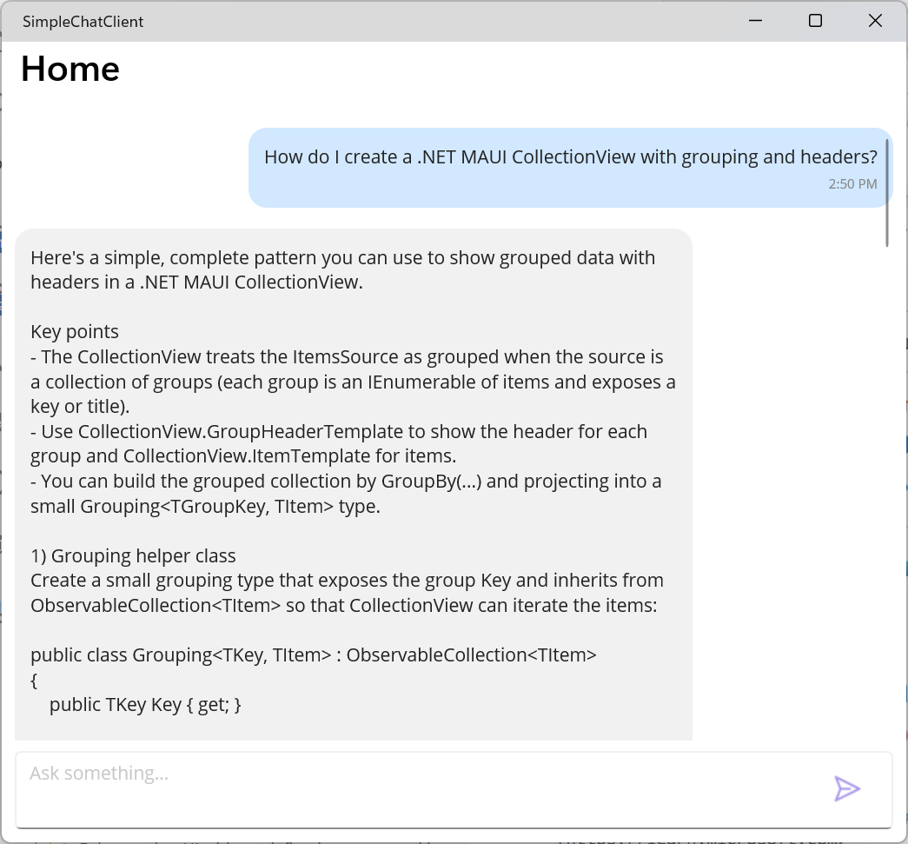

# SimpleChatClient (MAUI + Microsoft.Extensions.AI)

A minimal .NET MAUI sample that wires Microsoft.Extensions.AI into a chat UI. It registers an IChatClient via a Host Builder extension using Azure AI Foundry (OpenAI-compatible) and demonstrates MVVM command binding, a CollectionView EmptyView, and a simple "typing" placeholder while awaiting responses.



## What you'll learn

- How to register and consume IChatClient (Microsoft.Extensions.AI) with DI in a MAUI app
- How to configure Azure AI Foundry/OpenAI-compatible endpoints using environment variables
- How to drive a chat UI with MVVM (CommunityToolkit.Mvvm) and update the UI as responses arrive
- How to use a CollectionView EmptyView for a “first-run” prompt experience

## Prerequisites

- .NET SDK compatible with the repo branch (Windows desktop build shown)
- Azure AI Foundry (or Azure OpenAI) endpoint and API key — see [Set up: retrieve key and endpoint](https://learn.microsoft.com/azure/ai-foundry/openai/chatgpt-quickstart#set-up)

## Configure (desktop; environment variables)

Set these variables for your user profile so the app can connect to your Foundry/OpenAI-compatible endpoint:

- AZURE_OPENAI_ENDPOINT (required) — for example `https://your-endpoint`
- AZURE_OPENAI_API_KEY (required)
- AZURE_OPENAI_MODEL (optional; defaults to `gpt-4o-mini`)

PowerShell (per-user, persistent):

```powershell
[System.Environment]::SetEnvironmentVariable('AZURE_OPENAI_ENDPOINT','https://your-endpoint','User')
[System.Environment]::SetEnvironmentVariable('AZURE_OPENAI_API_KEY','your-api-key','User')
# Optional
[System.Environment]::SetEnvironmentVariable('AZURE_OPENAI_MODEL','gpt-4o-mini','User')
```

Restart your IDE/terminal after setting variables.

## How it’s wired

- `Services/HostingExtensions.cs`: Adds `AddFoundryChatClient()`, reading environment variables and registering a singleton `IChatClient` backed by `AzureOpenAIClient`.
- `MauiProgram.cs`: On Windows, calls `AddFoundryChatClient()` and registers `ChatViewModel`.
- `ViewModels/ChatViewModel.cs`: Injects `IChatClient`, exposes `Send`/`SendPrompt` commands, and simulates typing by inserting a temporary "..." assistant message and replacing it with the final response.
- `MainPage.xaml`: CollectionView with EmptyView containing four sample prompts as big bordered buttons.

## Run (Windows desktop)

Build and run the Windows target. Once running, pick a sample prompt or type your own and press Send.

## Useful docs and resources

- Microsoft.Extensions.AI overview — [learn.microsoft.com/dotnet/ai/microsoft-extensions-ai](https://learn.microsoft.com/dotnet/ai/microsoft-extensions-ai)
- Azure AI Foundry integration with IChatClient (Aspire) — [learn.microsoft.com/dotnet/aspire/azureai/azureai-foundry-integration#client-integration](https://learn.microsoft.com/dotnet/aspire/azureai/azureai-foundry-integration#client-integration)
- Azure OpenAI / Azure AI Foundry quickstart (environment setup) — [learn.microsoft.com/azure/ai-foundry/openai/chatgpt-quickstart#set-up](https://learn.microsoft.com/azure/ai-foundry/openai/chatgpt-quickstart#set-up)
- NuGet packages:
  - [Microsoft.Extensions.AI](https://www.nuget.org/packages/Microsoft.Extensions.AI)
  - [Microsoft.Extensions.AI.OpenAI](https://www.nuget.org/packages/Microsoft.Extensions.AI.OpenAI)
  - [Azure.AI.OpenAI](https://www.nuget.org/packages/Azure.AI.OpenAI)
  - [CommunityToolkit.Mvvm](https://learn.microsoft.com/dotnet/communitytoolkit/mvvm/)

## Notes

- This sample prefers environment variables for desktop development and ignores mobile configuration.
- If you change models or endpoints, restart the app after updating environment variables.
