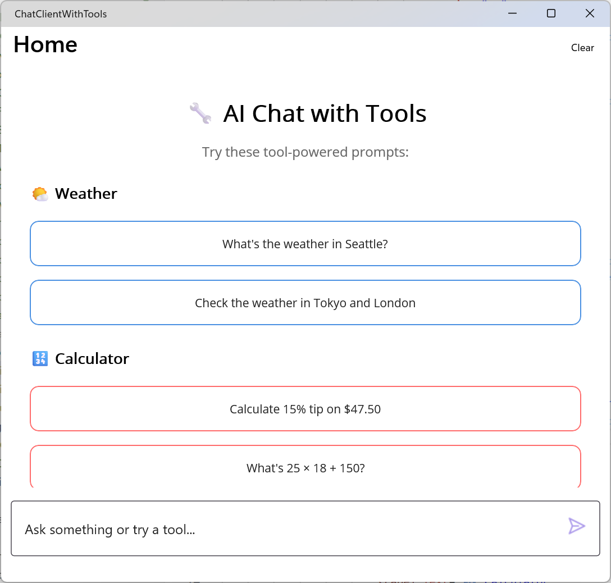

# ChatClientWithTools (MAUI + Microsoft.Extensions.AI Tools)

A .NET MAUI sample showing how to enhance using an LLM via `Microsoft.Extensions.AI` with function calling. This can improve reliability and repeatability of responses, as well as enable the LLM to answer queries it otherwise could not.



## What you'll learn

- Supplying a set of `AIFunction` tools to `IChatClient` via `ChatOptions.Tools`
- Implementing strongly described tool schemas (JSON schema) for better LLM argument selection
- Resolving user-friendly locations to coordinates with a geocode API, then calling a weather endpoint
- Building rich MAUI UI cards for different tool result types (weather, files, timers, etc.)
- Safe fallbacks (mock data) when external APIs or permissions are missing

## Prerequisites

- .NET SDK matching this repo branch
- Azure AI Foundry (or Azure OpenAI) endpoint + API key (model supporting tools/function calling)
- Optional: OpenWeatherMap API key (for real weather; otherwise mock data)

## Environment variables (desktop convenience)

Set these for your user account (PowerShell examples):

```powershell
[System.Environment]::SetEnvironmentVariable('AZURE_OPENAI_ENDPOINT','https://your-endpoint','User')
[System.Environment]::SetEnvironmentVariable('AZURE_OPENAI_API_KEY','your-api-key','User')
[System.Environment]::SetEnvironmentVariable('AZURE_OPENAI_MODEL','gpt-4o-mini','User')  # optional
[System.Environment]::SetEnvironmentVariable('WEATHER_API_KEY','your-openweather-key','User') # optional
```

Restart IDE/terminal so the process sees new values.

## Tools implemented

| Tool | Name | Purpose | Notes |
|------|------|---------|-------|
| WeatherTool | `get_weather` | Current conditions for a location | Geocodes first (direct geocoding API) then queries weather by lat/lon; mock fallback w/ note |
| CalculatorTool | `calculate` | Evaluate arithmetic / percentages | Sanitizes expression & returns formatted result |
| FileOperationsTool | `list_files` | List files & folders in a common or given path | Limits count; resolves shortcuts (Documents, Desktop, Downloads) |
| SystemInfoTool | `get_system_info` | Battery, storage, memory, device info | Uses safe simulated values on unsupported platforms |
| TimerTool | `set_timer` | Create a one‑shot timer with title | Keeps in-memory timers; prints completion to console |

Each tool subclasses `AIFunction` and overrides: `Name`, `Description`, `JsonSchema`, and `InvokeCoreAsync` (returning a serializable object for binding).

## Key files

- `Services/HostingExtensions.cs` – Registers `IChatClient` (AzureOpenAIClient under the hood) and all tool singletons.
- `Services/Tools/*.cs` – Tool implementations (plain `AIFunction` subclasses; no custom base abstraction to keep things clear).
- `ViewModels/ChatViewModel.cs` – Collects tools and invokes `_chatClient.GetResponseAsync` passing `ChatOptions.Tools`.
- `Models/ChatMessage.cs` – Chat + tool result model with typed helper accessors and UI flags.
- `MainPage.xaml` – Chat layout, rich cards per tool result, EmptyView sample prompts, and a `Clear` toolbar item (resets to EmptyView).

## Sample prompts

Try:

- "What's the weather in Seattle, Washington?"
- "Calculate 15% tip on $47.50"
- "List the files in my Documents folder"
- "Show me current battery level and available storage"
- "Set a 5-minute timer for my coffee break"
- "What's 25 * 18 + 150?"
- "Check the weather in Tokyo and London"

## Running (Windows desktop)

Build target `net10.0-windows10.0.19041.0` and run. Use a sample prompt or type your own. Use the toolbar "Clear" to reset and revisit the instructional prompt list.

## Architecture highlights

### Tool invocation flow

1. User sends natural language input.
2. `ChatViewModel` builds `ChatOptions` with the registered tool objects.
3. `IChatClient` (Microsoft.Extensions.AI) decides if any tool(s) should be invoked and executes them, passing JSON arguments that conform to each tool's declared schema.
4. Tool result objects surface in the assistant response stream and are bound to specialized UI cards.
5. UI shows structured cards or plain text depending on `ChatMessage` flags.

### Reliability & fallback

- Weather: If geocode or weather fetch fails (or no API key), returns deterministic mock data with a short annotation so the user knows it's simulated.
- System info & battery: Returns simulated ranges on unsupported platforms so the UI still illustrates the concept.
- File listing: Restricts to user directories and caps entries to prevent large payloads.

### UI features

- EmptyView with categorized starter buttons (Weather / Calculator / Files / System Info / Timers).
- Rich result cards styled with color-coded borders.
- Toolbar "Clear" to wipe conversation state quickly (teaching scenario friendly).
- Auto-scroll to the latest message.

## Useful references

- Microsoft.Extensions.AI overview: <https://learn.microsoft.com/dotnet/ai/microsoft-extensions-ai>
- Azure AI Foundry OpenAI quickstart (environment setup): <https://learn.microsoft.com/azure/ai-foundry/openai/chatgpt-quickstart#set-up>
- CommunityToolkit.Mvvm: <https://learn.microsoft.com/dotnet/communitytoolkit/mvvm/>

## Notes & disclaimers

- Requires a model that supports tool (function) calling. Adjust `AZURE_OPENAI_MODEL` as needed.
- Weather and other external APIs may rate limit; mock fallbacks keep the UX consistent.
- Timers are in-memory only (lost on app exit) and currently surface completion via console log.
- File operations intentionally conservative; expand with care for security.
- This sample emphasizes pedagogy over exhaustive production hardening.

---
If you want a lighter starting point without tools, see the `SimpleChatClient` sample in the same folder tree.
