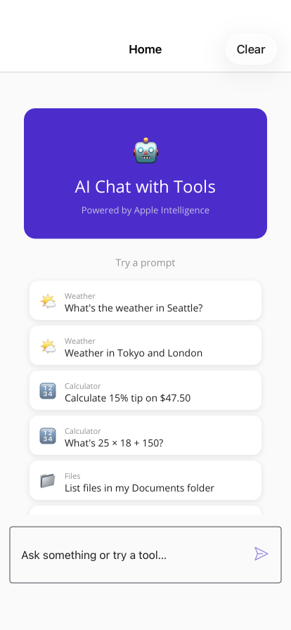
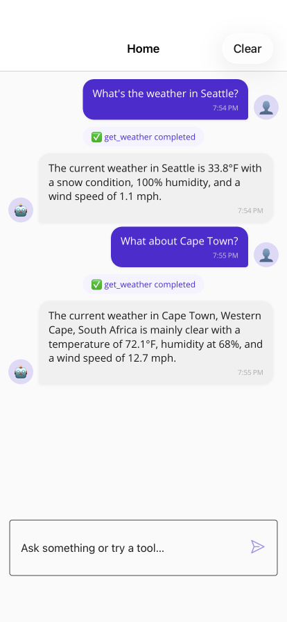
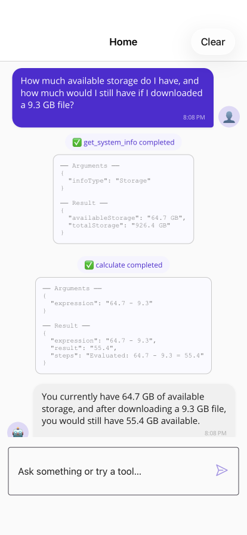

# LocalChatClientWithTools (MAUI + On-Device Apple Intelligence Tools)

A .NET MAUI sample showing how to enhance an on-device LLM with `Microsoft.Extensions.AI` function calling (tools) using Apple Intelligence. All inference runs locally — **no API keys, no cloud services, no cost**.

| Prompt buttons | Weather tool | Calculator tool | Multi-tool calls |
|:-:|:-:|:-:|:-:|
|  |  |  |  |

## What you'll learn

- Using `AppleIntelligenceChatClient` from `Microsoft.Maui.Essentials.AI` as a local `IChatClient`
- Supplying a set of `AIFunction` tools to `IChatClient` via `ChatOptions.Tools`
- Implementing strongly described tool schemas (JSON schema) for better argument selection
- Resolving user-friendly locations to coordinates with the free [open-meteo.com](https://open-meteo.com) API
- Building rich MAUI UI cards for different tool result types (weather, files, timers, etc.)
- Running AI inference entirely on-device with no external API keys

## Prerequisites

- .NET 10 SDK (preview)
- iOS 26.0+ or macCatalyst 26.0+ device/simulator with Apple Intelligence enabled
- No API keys or cloud accounts needed

## Tools implemented

| Tool | Name | Purpose | Notes |
|------|------|---------|-------|
| WeatherTool | `get_weather` | Current conditions for a location | Geocodes via open-meteo.com, then fetches forecast — free, no API key |
| CalculatorTool | `calculate` | Evaluate arithmetic / percentages | Sanitizes expression & returns formatted result |
| FileOperationsTool | `list_files` | List files & folders in a common or given path | Limits count; resolves shortcuts (Documents, Desktop, Downloads) |
| SystemInfoTool | `get_system_info` | Battery, storage, memory, device info | Uses safe simulated values on unsupported platforms |
| TimerTool | `set_timer` | Create a one‑shot timer with title | Keeps in-memory timers; prints completion to console |

Each tool subclasses `AIFunction` and overrides: `Name`, `Description`, `JsonSchema`, and `InvokeCoreAsync` (returning a serializable object for binding).

## Key files

- `Services/HostingExtensions.cs` – Registers `IChatClient` via `AppleIntelligenceChatClient` with `UseFunctionInvocation()` for automatic tool dispatch.
- `Services/Tools/*.cs` – Tool implementations (plain `AIFunction` subclasses; no custom base abstraction to keep things clear).
- `ViewModels/ChatViewModel.cs` – Collects tools and invokes `_chatClient.GetResponseAsync` passing `ChatOptions.Tools`.
- `Models/ChatMessage.cs` – Chat + tool result model with typed helper accessors and UI flags.
- `MainPage.xaml` – Chat layout, rich cards per tool result, EmptyView sample prompts, and a `Clear` toolbar item (resets to EmptyView).

## Sample prompts

Try:

- "What's the weather in Seattle?"
- "Calculate 15% tip on $47.50"
- "List the files in my Documents folder"
- "Show me current battery level and available storage"
- "Set a 5-minute timer for my coffee break"
- "What's 25 × 18 + 150?"
- "Check the weather in Tokyo and Cape Town"

## Run

```bash
# iOS simulator
dotnet build -f net10.0-ios -t:Run

# macCatalyst
dotnet build -f net10.0-maccatalyst -t:Run
```

Use a sample prompt or type your own. Use the toolbar **Clear** to reset and revisit the instructional prompt list.

> **Note:** This sample only runs on Apple platforms (iOS / macCatalyst) with Apple Intelligence. Other platforms will throw `PlatformNotSupportedException` at startup.

## NuGet feed configuration

This sample requires the .NET 10 preview NuGet feed for `Microsoft.Maui.Essentials.AI`. The included `NuGet.config` adds:

```
https://pkgs.dev.azure.com/dnceng/public/_packaging/dotnet10/nuget/v3/index.json
```

## Architecture highlights

### Tool invocation flow

1. User sends natural language input.
2. `ChatViewModel` builds `ChatOptions` with the registered tool objects.
3. `AppleIntelligenceChatClient` (wrapped with `UseFunctionInvocation()`) decides if any tool(s) should be invoked and executes them, passing JSON arguments that conform to each tool's declared schema.
4. Tool result objects surface in the assistant response and are bound to specialized UI cards.
5. UI shows structured cards or plain text depending on `ChatMessage` flags.

### On-device vs. cloud

This sample is a local-only variant of the `ChatClientWithTools` sample. The key differences:

| | ChatClientWithTools | LocalChatClientWithTools |
|---|---|---|
| **LLM provider** | Azure OpenAI (cloud) | Apple Intelligence (on-device) |
| **API keys** | Required (Azure + optional OpenWeatherMap) | None |
| **Weather API** | OpenWeatherMap (key required) | open-meteo.com (free, keyless) |
| **Platforms** | Windows, iOS, macCatalyst, Android | iOS, macCatalyst only |
| **NuGet packages** | Azure.AI.OpenAI, Microsoft.Extensions.AI.OpenAI | Microsoft.Maui.Essentials.AI |

### UI features

- EmptyView with categorized starter buttons (Weather / Calculator / Files / System Info / Timers).
- Rich result cards styled with color-coded borders.
- Toolbar "Clear" to wipe conversation state quickly (teaching scenario friendly).
- Auto-scroll to the latest message.

## Useful references

- Microsoft.Extensions.AI overview: <https://learn.microsoft.com/dotnet/ai/microsoft-extensions-ai>
- Apple Intelligence in .NET MAUI: <https://learn.microsoft.com/dotnet/maui/platform-integration/communication/ai>
- CommunityToolkit.Mvvm: <https://learn.microsoft.com/dotnet/communitytoolkit/mvvm/>

## Notes

- Requires iOS 26.0+ or macCatalyst 26.0+ with Apple Intelligence available and enabled.
- All AI inference runs on-device — no data leaves the device for LLM processing.
- Weather data comes from [open-meteo.com](https://open-meteo.com) (free, open-source weather API).
- Timers are in-memory only (lost on app exit) and currently surface completion via console log.
- File operations are intentionally conservative; expand with care for security.
- This sample emphasizes pedagogy over exhaustive production hardening.

---
For the cloud-hosted version of this sample, see `ChatClientWithTools` in the same folder tree.
