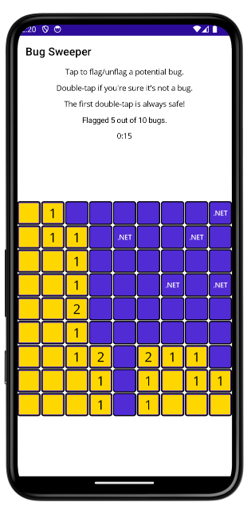

# BugSweeper

This is a familiar game with a new twist. Ten bugs are hidden in a 9-by-9 grid of tiles. To win, you must find and flag all ten bugs.

Begin playing by double tapping any tile. That first double tap is always safe. Thereafter, numbers indicate the number of surrounding tiles with bugs. If you know that a tile has a bug, flag it (or unflag it) with a single tap. Avoid double-tapping a tile with a bug!

