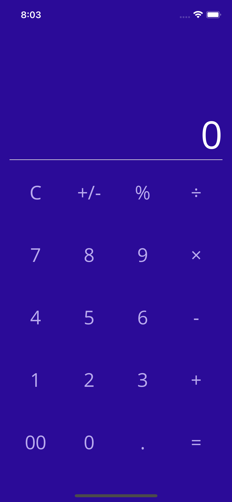

# Calculator Sample App

This basic calculator demonstrates using span and spacing features of a Grid layout to achieve a familiar interface.

For more information, see the [Grid documentation](https://docs.microsoft.com/dotnet/maui/user-interface/layouts/grid).

