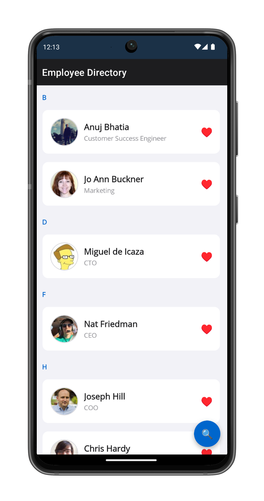

# Employee Directory (.NET MAUI)

This employee directory application demonstrates the capabilities of .NET MAUI with a comprehensive contact management system. The app showcases both C# and XAML UI implementations, platform-specific services, and data management features.



## Features

- **Dual UI Implementation**: Switch between C# and XAML views
- **Employee Search**: Search through employee directory with filtering
- **Favorites System**: Mark and manage favorite employees
- **Platform Integration**: Call, email, browse, tweet, and map functionality
- **Data Management**: CSV-based employee data with caching
- **Login System**: Simple authentication mechanism
- **Cross-Platform**: Runs on Android, iOS, macOS, and Windows

## Getting Started

### Prerequisites

- .NET 9.0 or later
- Visual Studio 2022 or Visual Studio Code
- .NET MAUI workload installed

### Running the Application

1. Clone the repository
2. Open the solution in Visual Studio
3. Select your target platform
4. Run the application

## UI Implementation Switching

To switch between C# and XAML UI implementations, modify the `UIImplementation` setting in `App.xaml.cs`:

```csharp
// For C# UI
private static UIImplementation uiImplementation = UIImplementation.CSharp;

// For XAML UI
private static UIImplementation uiImplementation = UIImplementation.Xaml;
```

## Architecture

The application follows a clean architecture pattern with:

- **ViewModels**: Business logic and data binding
- **Views**: UI implementations (both C# and XAML)
- **Services**: Data access and platform-specific functionality
- **Data**: Models and data management
- **Utilities**: Helper classes and extensions

## Platform-Specific Features

The app includes platform-specific services for:

- **Phone Calls**: Direct dialing functionality
- **Email**: Launch email client with pre-filled recipient
- **Web Browsing**: Open URLs in default browser
- **Social Media**: Share on Twitter
- **Maps**: Open addresses in maps application

## Data Management

Employee data is loaded from a CSV file and cached for performance. The application supports:

- CSV parsing and data loading
- In-memory caching
- Search and filtering
- Favorites persistence using XML storage

## Learning Objectives

This sample demonstrates:

- .NET MAUI cross-platform development
- MVVM pattern implementation
- Platform-specific service integration
- Data binding and UI updates
- File system access and data persistence
- Navigation between pages
- Dual UI implementation strategies