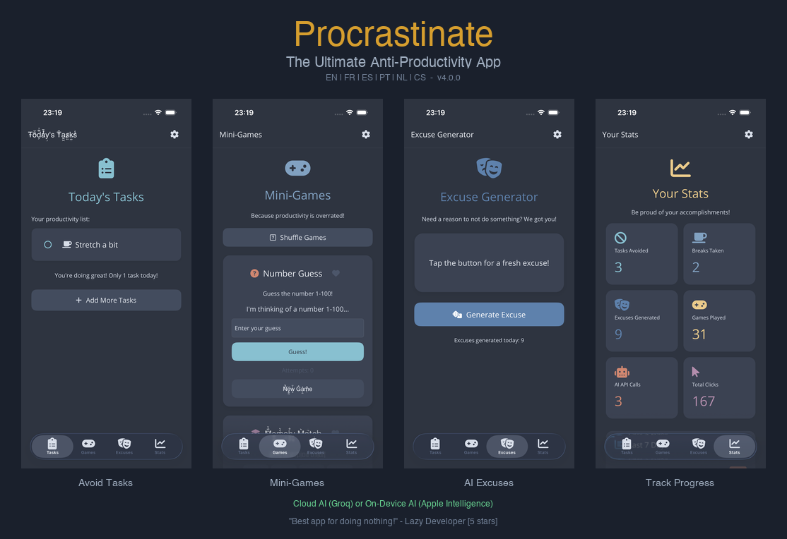

# Procrastinate - The Ultimate Anti-Productivity App

This sample app demonstrates advanced .NET MAUI features through a humorous anti-productivity theme. It showcases Shell navigation with tabs, AI integration with both cloud (Groq) and on-device (Apple Intelligence) providers, multi-language localization, theming with the Nord color palette, and various mini-games.



## Features Demonstrated

- **Shell Navigation** - Tab-based navigation with 4 main pages
- **AI Integration** - Cloud AI (Groq/Llama) and On-Device AI (Apple Intelligence via native xcframework)
- **Localization** - Full translation in 6 languages (English, French, Spanish, Portuguese, Dutch, Czech)
- **Custom Theming** - Nord color palette with dark/light theme support
- **Mini-Games** - 9 games including Simon Says, Minesweeper, Tic Tac Toe (with AI opponent), Snake, Memory Match
- **Native Interop** - Custom Swift xcframework for Apple Intelligence Foundation Models
- **XAML Source Generator** - Uses `MauiXamlInflator=SourceGen` for faster XAML loading
- **Plugin.Maui.Audio** - Sound effects for Simon Says game
- **Preferences API** - Settings persistence
- **Responsive UI** - Adapts to different screen sizes

## Project Structure

- `Pages/` - Main pages (Tasks, Games, Excuses, Stats, Settings)
- `Pages/Games/` - Mini-game implementations
- `Services/` - AI generators, stats tracking, click tracking
- `Resources/Strings/` - Localization resource files
- `Platforms/iOS/FMWrapper.xcframework/` - Native Apple Intelligence wrapper

## AI Setup (Optional)

### Cloud AI (Groq)
1. Create a free account at [Groq Console](https://console.groq.com/)
2. Generate an API key
3. Enter the key in the app's Settings page

### On-Device AI (Apple Intelligence)
- Requires iOS 18.4+ or macOS 15.4+ with Apple Intelligence enabled
- Uses the native FMWrapper.xcframework included in the project

## Building

```bash
# iOS
dotnet build -f net10.0-ios

# Android  
dotnet build -f net10.0-android

# macOS
dotnet build -f net10.0-maccatalyst
```

## Documentation Links

- [Shell Navigation](https://docs.microsoft.com/dotnet/maui/fundamentals/shell/navigation)
- [Localization](https://docs.microsoft.com/dotnet/maui/fundamentals/localization)
- [Preferences](https://docs.microsoft.com/dotnet/maui/platform-integration/storage/preferences)
- [Native Library References](https://docs.microsoft.com/dotnet/maui/platform-integration/native-embedding)
