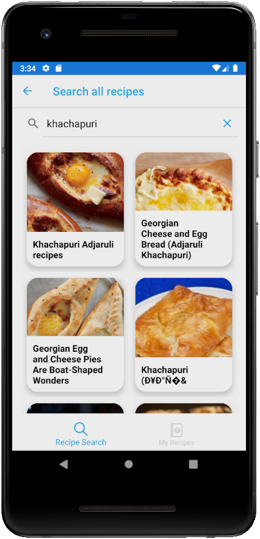

# WhatToEat

This is a [.NET MAUI](https://github.com/dotnet/maui) app showcasing how to effectively use Shell for intuitive navigation and seamless app structuring. It showcases key features, including navigation patterns and route management, to help developers build robust and user-friendly applications.

## Additional Resources

https://docs.microsoft.com/dotnet/maui

https://github.com/dotnet/maui
