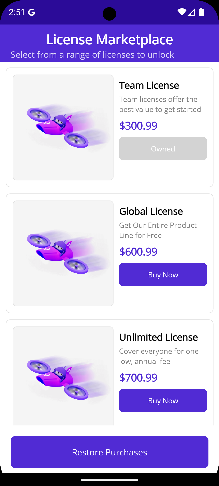

# BillingService (MAUI + Cross-Platform Billing)

A comprehensive .NET MAUI sample that demonstrates implementing in-app purchases for Android, iOS, and Windows applications. This sample shows how to integrate platform-specific billing systems (Google Play Billing for Android, StoreKit for iOS, and Microsoft Store for Windows) with a unified interface and clean MVVM architecture.



## What you'll learn

• How to implement cross-platform billing in a .NET MAUI application across multiple platforms
• How to create a unified billing service interface for Android, iOS, and Windows
• How to use Google Play Billing Client (Android), StoreKit (iOS), and Microsoft Store APIs (Windows)
• How to use MVVM pattern with dependency injection for billing operations
• How to handle product listings, purchases, and purchase restoration on all platforms
• How to implement value converters for dynamic UI updates based on purchase state
• How to structure a billing service with proper initialization and error handling
• Platform-specific best practices for Android, iOS, and Windows billing

## Prerequisites

• .NET 10.0 SDK or later
• Visual Studio 2022 17.13+ or Visual Studio Code with .NET MAUI extension
• Android SDK (for Android deployment)
• Xcode and iOS SDK (for iOS deployment on macOS)
• Windows SDK (for Windows deployment on Windows)
• Google Play Console account (for Android production billing setup)
• Apple Developer account and App Store Connect access (for iOS production billing setup)
• Microsoft Partner Center account (for Windows production billing setup)
• Android device or emulator / iOS device or simulator / Windows device for testing

## Features

### Core Billing Functionality

- **Product Discovery**: Retrieve available in-app products from Google Play / App Store / Microsoft Store
- **Purchase Flow**: Handle secure purchase transactions on all platforms
- **Purchase Restoration**: Restore previous purchases for users across platforms
- **Ownership Verification**: Check if products are already owned
- **Cross-Platform Abstraction**: Unified interface across Android, iOS, and Windows

### Architecture Components

- **IBillingService**: Unified billing service interface
- **BaseBillingService**: Shared base functionality and business logic
- **Platforms/Android/BillingService.cs**: Android implementation using Google Billing Client v7
- **Platforms/iOS/BillingService.cs**: iOS implementation using Apple StoreKit 1
- **Platforms/Windows/BillingService.cs**: Windows implementation using Microsoft Store APIs
- **MVVM Pattern**: Clean separation with ViewModels and data binding
- **Dependency Injection**: Platform-specific service registration

### UI Features

- **Product Grid**: Display available products with pricing
- **Purchase Status**: Visual indicators for owned/unowned products
- **Loading States**: User feedback during billing operations
- **Error Handling**: Graceful handling of billing errors

## Project Structure

```
BillingService/
├── Services/
│   ├── IBillingService.cs           # Unified billing service interface
│   └── BaseBillingService.cs        # Shared base implementation
├── Platforms/
│   ├── Android/
│   │   ├── BillingService.cs        # Android billing (Google Play Billing v7)
│   │   ├── AndroidManifest.xml      # Android permissions and configuration
│   │   └── MainActivity.cs          # Android main activity
│   ├── iOS/
│   │   ├── BillingService.cs        # iOS billing (StoreKit 1)
│   │   ├── Info.plist               # iOS configuration
│   │   └── AppDelegate.cs           # iOS app delegate
│   └── Windows/
│       ├── BillingService.cs        # Windows billing (Microsoft Store APIs)
│       ├── Package.appxmanifest     # Windows package configuration
│       └── App.xaml.cs              # Windows app configuration
├── Models/
│   ├── Product.cs                   # Product data model
│   └── PurchaseResult.cs           # Purchase result model
├── ViewModels/
│   ├── BaseViewModel.cs            # Base ViewModel with INotifyPropertyChanged
│   └── ProductsViewModel.cs        # Products page ViewModel
├── Views/
│   ├── ProductsPage.xaml           # Products listing page
│   └── ProductsPage.xaml.cs        # Code-behind
└── Converters/
    └── ValueConverters.cs          # XAML value converters
```

## How it's wired

• **`Services/IBillingService.cs`**: Defines the unified contract for billing operations including initialization, product retrieval, and purchase handling across all platforms.

• **`Services/BaseBillingService.cs`**: Provides shared business logic, product definitions, and ownership tracking used by Android, iOS, and Windows implementations.

• **`Platforms/Android/BillingService.cs`**: Implements Android billing using Google Play Billing Client v7 with support for product queries, purchases, and restoration.

• **`Platforms/iOS/BillingService.cs`**: Implements iOS billing using StoreKit 1 APIs with transaction observers and purchase restoration.

• **`Platforms/Windows/BillingService.cs`**: Implements Windows billing using Microsoft Store APIs (Windows.Services.Store) with support for product queries, purchases, and license verification.

• **`MauiProgram.cs`**: Registers the billing service implementation (`Services.BillingService`) and ViewModels in the dependency injection container.

• **`ViewModels/ProductsViewModel.cs`**: Exposes billing operations as commands, manages product collections, and handles UI state updates (platform-agnostic).

• **`Views/ProductsPage.xaml`**: CollectionView displaying products with purchase buttons and visual indicators for ownership status.

• **`Converters/ValueConverters.cs`**: Provides XAML converters for boolean-to-text, boolean-to-color, and inverse boolean transformations.

## Configuration

### Android Setup

1. **Product Configuration**:
   Update the product IDs in your billing service to match those configured in Google Play Console:
   - Sign in to [Google Play Console](https://play.google.com/console)
   - Navigate to your app → Monetize → In-app products
   - Create products with IDs: `Team_license`, `Global_license`, `Unlimited_license`

2. **Testing**:
   - Add license testers in Google Play Console
   - Use internal testing track for testing purchases

### iOS Setup

1. **Product Configuration**:
   Update the product IDs in your billing service to match those configured in App Store Connect:
   - Sign in to [App Store Connect](https://appstoreconnect.apple.com/)
   - Navigate to your app → Features → In-App Purchases
   - Create products with IDs: `Team_license`, `Global_license`, `Unlimited_license`

2. **Testing**:
   - Create sandbox tester accounts in App Store Connect
   - Use sandbox account on device for testing purchases

3. **Additional Requirements**:
   - Sign Paid Applications Agreement in App Store Connect
   - Configure tax and banking information

### Windows Setup

1. **Product Configuration**:
   Update the product IDs in your billing service to match those configured in Partner Center:
   - Sign in to [Microsoft Partner Center](https://partner.microsoft.com/)
   - Navigate to your app → Monetize → Add-ons
   - Create products with IDs: `Team_license`, `Global_license`, `Unlimited_license`

2. **App Association**:
   - Associate your app with the Microsoft Store in Visual Studio
   - Project → Store → Associate App with the Store
   - Complete the wizard to link your project to your Partner Center app

3. **Testing**:
   - Publish your app to the Store (can be hidden from discovery for testing)
   - Install the Store version on your development device
   - The local license will be used for testing

## Run the Application

### Android

1. Ensure Android SDK is properly configured
2. Set up an Android device or emulator
3. Build and deploy:

   ```bash
   dotnet build -f net10.0-android
   dotnet run -f net10.0-android
   ```

### iOS

1. Ensure Xcode and iOS SDK are installed (macOS only)
2. Set up an iOS device or simulator
3. Build and deploy:

   ```bash
   dotnet build -f net10.0-ios
   dotnet run -f net10.0-ios
   ```

### Windows

1. Ensure Windows SDK is properly configured (Windows only)
2. Set up a Windows device
3. Build and deploy:

   ```bash
   dotnet build -f net10.0-windows10.0.22000.0
   dotnet run -f net10.0-windows10.0.22000.0
   ```

### Key Features Demonstrated

**Product Listing**: The app retrieves and displays available in-app products with their details and pricing from each platform's store.

**Purchase Flow**: Tapping a product initiates the platform-specific purchase flow (Google Play on Android, StoreKit on iOS, Microsoft Store on Windows) with proper error handling.

**Visual Feedback**: Products show different states (owned/not owned) with color coding and text changes across all platforms.

**Restoration**: Users can restore previous purchases across devices.

## Dependencies

• **Microsoft.Maui.Controls**: Core MAUI framework
• **Xamarin.Android.Google.BillingClient**: Google Play Billing integration
• **Syncfusion.Maui.Toolkit**: Additional UI components
• **Microsoft.Extensions.Logging.Debug**: Debug logging support

## Architecture Patterns

### MVVM Implementation

- Uses `INotifyPropertyChanged` for data binding
- Commands for user interactions
- Separation of concerns between Views and ViewModels

### Service Pattern

- Unified billing interface with platform-specific implementations
- Android: Google Play Billing Client v7
- iOS: StoreKit 1 with transaction observers
- Windows: Microsoft Store APIs (Windows.Services.Store)
- Dependency injection for loose coupling

### Error Handling

- Comprehensive error handling in billing operations
- User-friendly error messages
- Graceful degradation when billing is unavailable

## Useful docs and resources

• Google Play Billing documentation — [developer.android.com/google/play/billing](https://developer.android.com/google/play/billing)
• Apple StoreKit documentation — [developer.apple.com/storekit](https://developer.apple.com/storekit/)
• Microsoft Store in-app purchases — [learn.microsoft.com/windows/uwp/monetize/in-app-purchases-and-trials](https://learn.microsoft.com/en-us/windows/uwp/monetize/in-app-purchases-and-trials)
• .NET MAUI documentation — [learn.microsoft.com/dotnet/maui](https://learn.microsoft.com/dotnet/maui/)
• NuGet packages:
  ◦ [Microsoft.Maui.Controls](https://www.nuget.org/packages/Microsoft.Maui.Controls)
  ◦ [Xamarin.Android.Google.BillingClient](https://www.nuget.org/packages/Xamarin.Android.Google.BillingClient)
  ◦ [Syncfusion.Maui.Toolkit](https://www.nuget.org/packages/Syncfusion.Maui.Toolkit)

## Notes

• This sample demonstrates cross-platform billing for Android (Google Play Billing), iOS (StoreKit), and Windows (Microsoft Store)
• Testing in-app purchases requires:
  - Android: Google Play Console setup and signed APKs
  - iOS: App Store Connect setup and sandbox tester accounts
  - Windows: Partner Center setup and published/test apps
• Always test thoroughly on all platforms before publishing to production

## Security Considerations

• Validate purchases server-side for production applications
• Implement receipt verification
• Handle edge cases like network interruptions during purchases
• Secure storage of purchase information
• For Windows: Ensure app is properly associated with Microsoft Store
