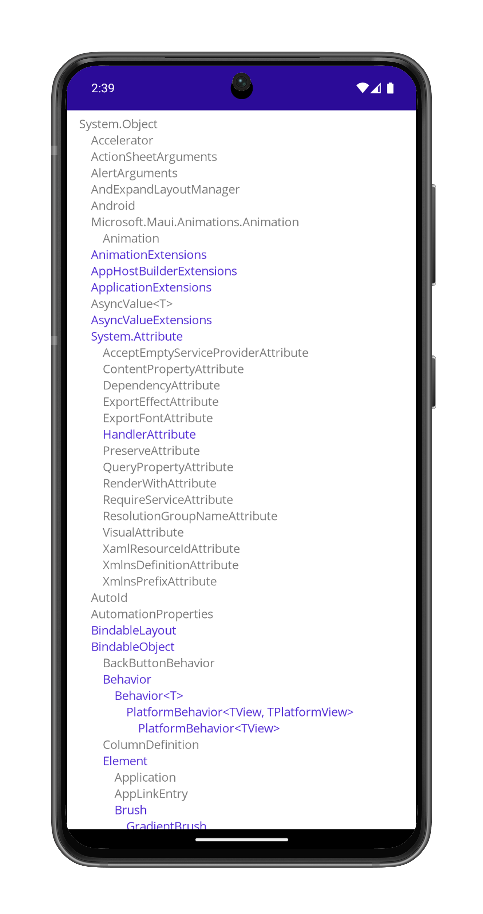

# ClassHierarchy

This program uses .NET reflection to display a scrollable hierarchy of all .NET MAUI classes, structures, and enumerations.
Non-instantiable classes are displayed in the app Primary color.

ClassHierarchy is a handy reference for .NET MAUI developers, as well as demonstrating using the StackLayout and ScrollView from code.

