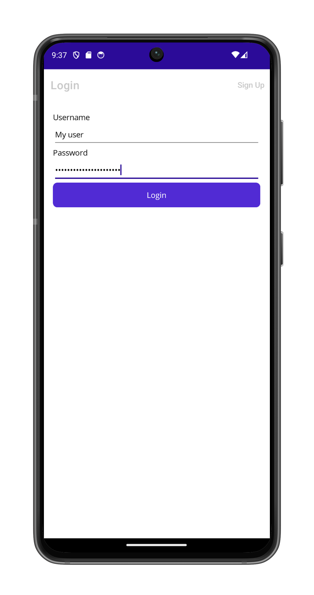

# LoginNavigation

This sample demonstrates how to manipulate the navigation stack in order to only display the main page of the application once the user has successfully logged in. The app shows login and sign-up functionality with proper navigation stack management to prevent users from navigating back to login screens after authentication.

The sample includes both XAML and programmatic C# implementations of the user interface to demonstrate different approaches to creating login flows in .NET MAUI.

