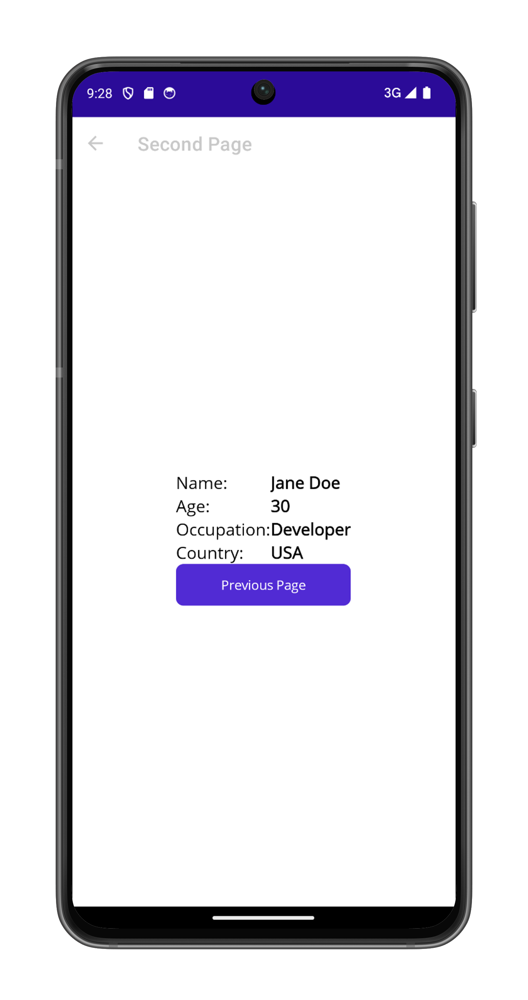

# PassingData

This sample demonstrates how to pass data between pages when navigating in .NET MAUI. The app shows different techniques for passing data including constructor parameters, BindingContext, and navigation parameters.

The sample includes both XAML and programmatic C# implementations to demonstrate different approaches to data passing and page creation in .NET MAUI applications.

