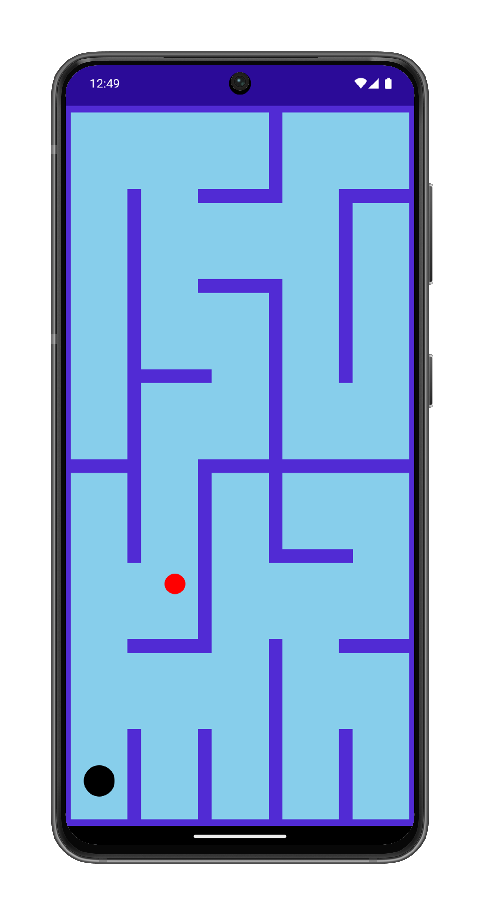

# Tilt Maze

**Tilt Maze** is a game for .NET MAUI that uses the cross-platform [`Accelerometer`](https://learn.microsoft.com/dotnet/maui/platform-integration/device/sensors/accelerometer?view=net-maui-9.0) included in .NET MAUI Essentials.

**Tilt Maze** runs on iOS, Android, and Windows, but you'll need to run the program on an actual phone, tablet, or supported desktop device rather than a simulator, ideally in Release mode. The objective is to tilt the device back and forth so that the red ball navigates through the maze and rolls down the black hole. (The ball must be entirely within the hole to fall down into it.) The maze then changes for another game.

A different version of this program originally appeared in the book _Programming Windows Phone 7_, published in 2010. That version used XNA for the graphics. The .NET MAUI version uses a custom `EllipseView` element for the ball and hole, and draws the maze walls using `BoxView` elements.

