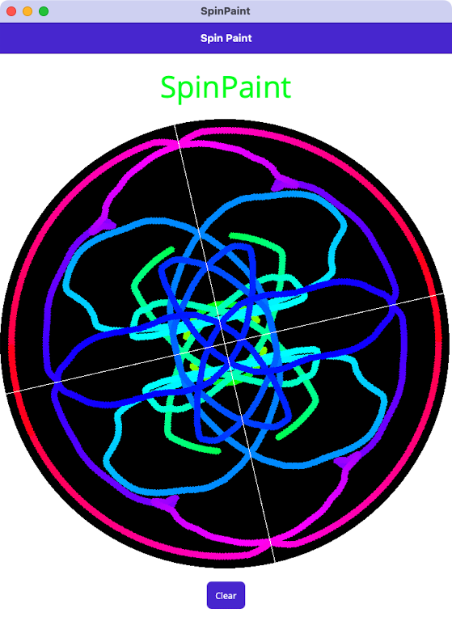

# SpinPaint

SpinPaint demonstrates the use of SkiaSharp in a .NET Multi-platform App UI (.NET MAUI) app. It simulates a revolving disk that you can paint on by touching and moving your fingers. SpinPaint responds to touch by painting a line under your finger, but it also duplicates that line in three mirror images in the other three quadrants of the disk. The current color of the line is indicated by the color of the title of the program above the disk.



## Use SkiaSharp in an app

To use SkiaSharp in your .NET MAUI app you should:

1. Add the `SkiaSharp.Views.Maui.Controls` NuGet package to your app. This will also install dependent SkiaSharp packages.
1. Initialize SkiaSharp in your app by calling the `UseSkiaSharp` method on the `MauiAppBuilder` object in your `MauiProgram` class:


```csharp
using Microsoft.Extensions.Logging;
using SkiaSharp.Views.Maui.Controls.Hosting;

namespace MyMauiApp;

public static class MauiProgram
{
    public static MauiApp CreateMauiApp()
    {
        var builder = MauiApp.CreateBuilder();
        builder
            .UseMauiApp<App>()
            .UseSkiaSharp()
            .ConfigureFonts(fonts =>
            {
                fonts.AddFont("OpenSans-Regular.ttf", "OpenSansRegular");
                fonts.AddFont("OpenSans-Semibold.ttf", "OpenSansSemibold");
            });

        #if DEBUG
        builder.Logging.AddDebug();
        #endif

        return builder.Build();
    }
}
```
