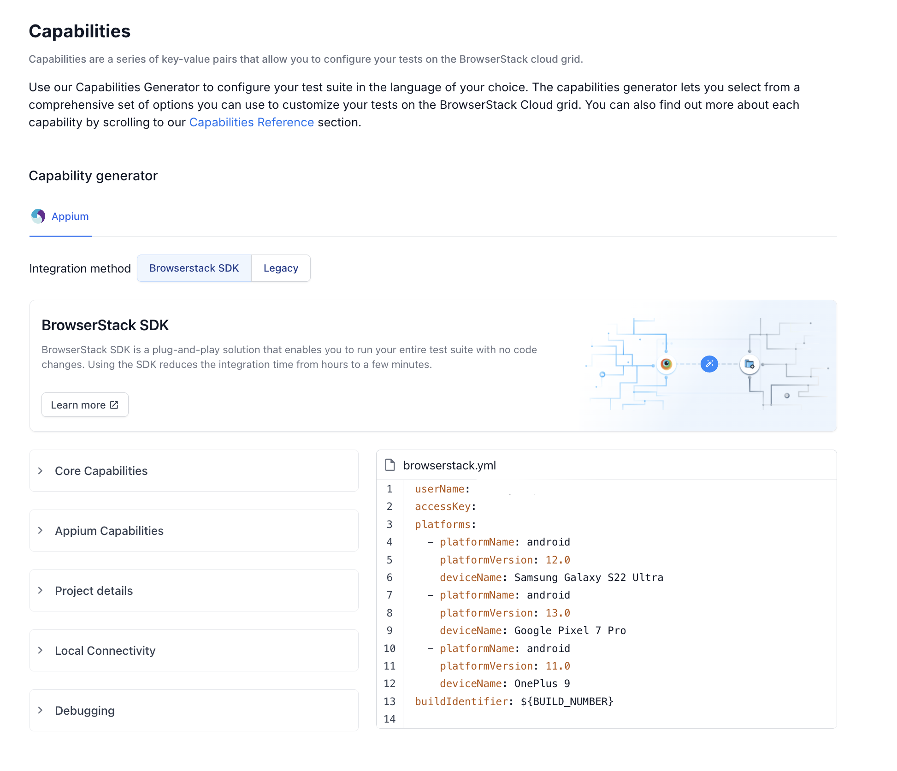
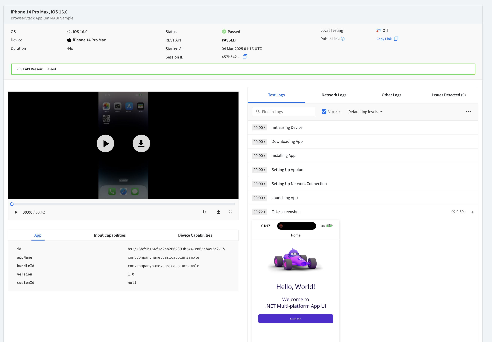
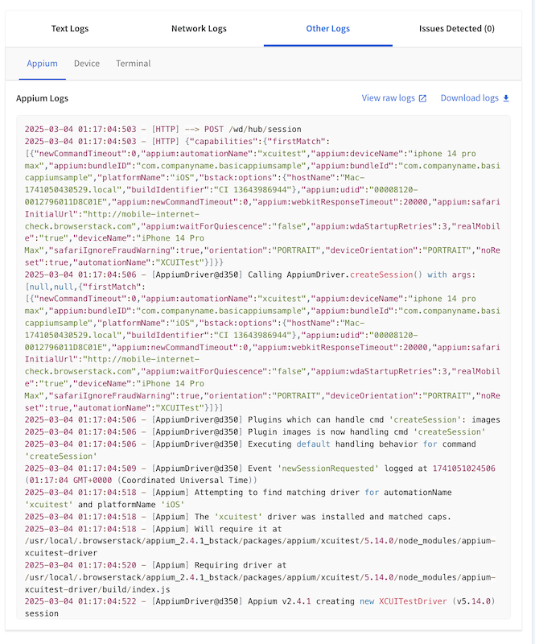

# Use BrowserStack App Automate with Appium NUnit UI tests for .NET MAUI Apps

This is a continuation of the sample [.NET MAUI - UI testing with Appium and NUnit](/samples/dotnet/maui-samples/uitest-appium-nunit/) created as part of Gerald's Blog [Getting started with UI testing .NET MAUI apps using Appium](https://devblogs.microsoft.com/dotnet/dotnet-maui-ui-testing-appium/). 

This repository code shows how to add [BrowserStack App Automate](https://www.browserstack.com/docs/app-automate/appium/overview) to your existing Appium Tests for .NET MAUI. This README provides a guide on setting up BrowserStack with your existing UITests and explains the GitHub Actions workflow used in this repository.

> **Note:** BrowserStack only supports .NET 8 at the time of writing. Therefore, the sample does not use .NET 9.
[BrowerserStack App Automate Appium + NUnit Prerequisite](https://www.browserstack.com/docs/app-automate/appium/getting-started/c-sharp/nunit/integrate-your-tests#prerequisites)

> **Note:** BrowserStack App Automate Device Cloud supports only iOS and Android devices at the moment, so that is the focus of this sample.
[BrowerserStack App Automate Device List](https://www.browserstack.com/list-of-browsers-and-platforms/app_automate)

## BrowserStack App Automate

BrowserStack’s [App Automate](https://www.browserstack.com/docs/app-automate/appium/overview) lets you test your native and hybrid apps on a variety of mobile and tablet devices. Devices you access are all real devices housed in our data centers.

- **Run tests on 2000+ real iOS and Android devices** 

   App Automate gives you instant access to 2000+ real iOS and Android devices, OS versions and form factors in the cloud, thereby reducing the cost of building and managing an in-house lab. You can test your app under real-world conditions and identify issues that might not appear in emulators or simulators.

- **Run test suites on BrowserStack in minutes**

   Use the BrowserStack SDK that allows you to integrate your test suites with App Automate in minutes. Simply install the SDK, set up a YAML file, and trigger your tests to get started. You can also leverage features like parallel orchestration and local testing with ease using the SDK. All this, with no code changes!

- **Test apps in real-world user conditions**

   BrowserStack lets you test the behaviour of your app on different devices under different network conditions. App Automate offers several presets also lets you define your own custom network conditions to check your app’s behaviour. You can also change the network conditions mid-way during the test run, just like in real world where the end-user’s network varies.

## Steps to Add BrowserStack to Existing UITests

1. **Sign Up for BrowserStack**:
   - Create an account on [BrowserStack](https://www.browserstack.com/) for a free trial.
   - Pricing details can be found [here](https://www.browserstack.com/accounts/subscriptions).

2. **Create BrowserStack Credentials**:
   - Obtain your `BROWSERSTACK_USERNAME` and `BROWSERSTACK_ACCESS_KEY` from the BrowserStack account settings.

3. **Store Credentials as GitHub Secrets**:
   - Go to your GitHub repository.
   - Navigate to `Settings` > `Secrets` > `Actions`.
   - Add two new secrets: `BROWSERSTACK_USERNAME` and `BROWSERSTACK_ACCESS_KEY`.

4. **Android and iOS BrowserStack Configuration Files**:
   
   - The repository includes BrowserStack configuration files for both Android and iOS projects. These files define the specific settings and capabilities required to run the tests on BrowserStack.

   The `browserstack.yml` file for the Android project can be found at [`BasicAppiumNunitSample/UITests.Android/browserstack.yml`](BasicAppiumNunitSample/UITests.Android/browserstack.yml) and
   the `browserstack.yml` file for the iOS project can be found at [`BasicAppiumNunitSample/UITests.iOS/browserstack.yml`](BasicAppiumNunitSample/UITests.iOS/browserstack.yml). 

   A few key parts of this configuration file are: 

   - **userName & accessKey**: These are your BrowserStack credentials. They can be hardcoded or set as environment variables.
   - **automationName**: Specifies the automation engine to be used. For iOS, `XCUITest` is commonly used and for Android `UIAutomator2` is commonly used.
   - **appiumVersion**: Specifies the version of Appium to use.
   - **app**: Path to the iOS app (IPA) or Android app (APK) to be tested. For .NET MAUI Apps, if the app is built part of the DevOps pipeline, you can add the path to the publish folder here. 
   - **browserstackLocal**: Set to `false` to run on BrowserStack App Automate Service, which runs the tests on the selected Devices on the Device Cloud.

   BrowserStack also has a really great [Capability Generator Tool](https://www.browserstack.com/docs/app-automate/capabilities) that walks through generating this `browerstack.yml` and you can copy paste the generated file from the tool into your repo. 

   

   > For more details on configuring BrowserStack for Android and iOS for Appium + NUnit Tests, plrease refer to the [BrowserStack Documentation](https://www.browserstack.com/docs/app-automate/appium/getting-started/c-sharp/nunit/integrate-your-tests).


5. **Update UI Tests to Use BrowserStack**:

   - To the respective `UITests.Android` and `UITests.iOS` folder, add the `browserstack.yml` files generated from Step 4. 

   > You will need to use separate `browserstack.yml` files for each platform.
   
   - To the respective `UITests.Android` and `UITests.iOS` projects, add the [BrowserStack.TestAdapter](https://www.nuget.org/packages/BrowserStack.TestAdapter) nuget package.
     ```
      <PackageReference Include="BrowserStack.TestAdapter" Version="0.13.3" />
     ```

5. **Run BrowserStack App Automate Tests**: 
    - Follow the informative [documentation](https://www.browserstack.com/docs/app-automate/appium/getting-started/c-sharp/nunit/integrate-your-tests) provided by BrowserStack to run the tests from your local machine. The tests can be run from [Visual Studio](https://www.browserstack.com/docs/app-automate/appium/getting-started/c-sharp/nunit/integrate-your-tests#Visual_Studio) on **Windows** or by [BrowserStack CLI](https://www.browserstack.com/docs/app-automate/appium/getting-started/c-sharp/nunit/integrate-your-tests#CLI) for **Mac**.

6. **Run BrowserStack App Automate Tests in GitHub Actions Workflow**:
   - Setup the GitHub Actions Workflow to run the BrowserStack App Automate Test as part of your CI/CD Automation. For Azure DevOps Pipelines, the steps can be found in the BrowserStack Documentation [here](https://www.browserstack.com/docs/app-automate/appium/integrations/azure).

## GitHub Actions Workflow

The GitHub Actions workflow file [`.github/workflows/browserStackTests.yml`](.github/workflows/browserStackTests.yml) is set up to run the UI Tests on BrowserStack for both iOS and Android platforms. For details on the steps that build the .NET MAUI App for testing, you can read this blog [Getting Started with DevOps and .NET MAUI](https://devblogs.microsoft.com/dotnet/devops-for-dotnet-maui/), this section will focus specifically on the steps for BrowserStack App Automate Tasks. 

#### Prerequisites for GitHub Actions

> You should set your BrowserStack Username and Access Key as GitHub Secrets, i.e. `BROWSERSTACK_USERNAME` and `BROWSERSTACK_ACCESS_KEY` respectively, as pointed out above.

- **Install Appium**: Installs Appium and the `XCUITest` or `UIAutomator2` driver respectively per platform. This is needed to build the `Tests.dll` used for running the tests. 

  ```bash
  npm install -g appium

  # For Android
  appium driver install uiautomator2

  # For iOS
  appium driver install xcuitest
  ```

 - **For VM Runner Macs with Apple Silicon Chips Only**:  
 
    When using a **Mac VM Runner with Apple Silicon**, we need the following extra step that installs the BrowserStack .NET tool and sets it up.
    ```bash
    dotnet tool install browserstack-sdk --version 1.16.3 --create-manifest-if-needed
    dotnet browserstack-sdk setup-dotnet --dotnet-path "." --dotnet-version "8.0.403" --yes
    ```
    [BrowserStack CLI Docs Step 3: [Only for Macs with Apple Silicon] Install dotnet x64 on MacOS](https://www.browserstack.com/docs/app-automate/appium/getting-started/c-sharp/nunit/integrate-your-tests#CLI)


- **Build Appium BrowserStack Tests**: Builds the Appium tests for Android or iOS 
  ```bash
  # For Android
  dotnet build BasicAppiumNunitSample/UITests.Android/UITests.Android.csproj

  # For iOS
  dotnet build BasicAppiumNunitSample/UITests.iOS/UITests.iOS.csproj
  ```
  
- **Run Appium BrowserStack Tests**: Runs the Appium tests on BrowserStack.
   ```bash
   # For Android
   dotnet test BasicAppiumNunitSample/UITests.Android/UITests.Android.csproj

   # For iOS
   ./dotnet test BasicAppiumNunitSample/UITests.iOS/UITests.iOS.csproj
   ```

## BrowserStack Test Reports and Dashboard

When you run your tests on BrowserStack, detailed test reports are generated. These reports include information such as test execution logs, screenshots, and videos of the test runs. You can access these reports through the [BrowserStack Dashboard](https://www.browserstack.com/users/sign_in).

### BrowserStack App Automate Dashboard

The [BrowserStack App Automate Dashboard](https://www.browserstack.com/docs/app-automate/appium/set-up-tests/view-test-results) provides detailed and comprehensive overview of the text execution. Alternatively, if you need to integrate with your own custom dashboard, you can use the [REST API](https://www.browserstack.com/docs/app-automate/api-reference/appium/overview).  



Some highlights of the App Automate Test Report Includes : 

- **Session Video**: Captures the recording of the test as it happens in the session. Use this recording to go at a precise point in time when an error occurred and debug.

<video width="380" height="824" controls>
  <source src="imgs/TestRunVideo.mp4" type="video/mp4">
</video>

- **Logs tab**: Select Text Logs, Console Logs, or Screenshots tab to view detailed logs. The Logs also include Appium Logs and Network Logs! 



## Summary

This repository demonstrates how to integrate [BrowserStack App Automate](https://www.browserstack.com/docs/app-automate/appium/overview) with Appium NUnit tests for .NET MAUI applications. It provides a comprehensive guide on setting up BrowserStack with your existing UITests and explains the GitHub Actions workflow used in this repository.

Importance of UI testing and tunning tests on real devices
is crucial for ensuring that your application behaves as expected from the user's perspective. Running tests on real devices, as opposed to emulators or simulators, helps identify issues that might only appear under real-world conditions, such as different network environments, device-specific quirks, and actual user interactions. [BrowserStack App Automate](https://www.browserstack.com/docs/app-automate/appium/overview) is a great service that makes it easy to run your existing Appium NUnit tests on their App Automate Device Cloud. 

Check out more .NET MAUI samples at [dotnet/maui-samples](https://github.com/dotnet/maui-samples). Please let us know if anything is unclear or what you would like to see in future samples!
