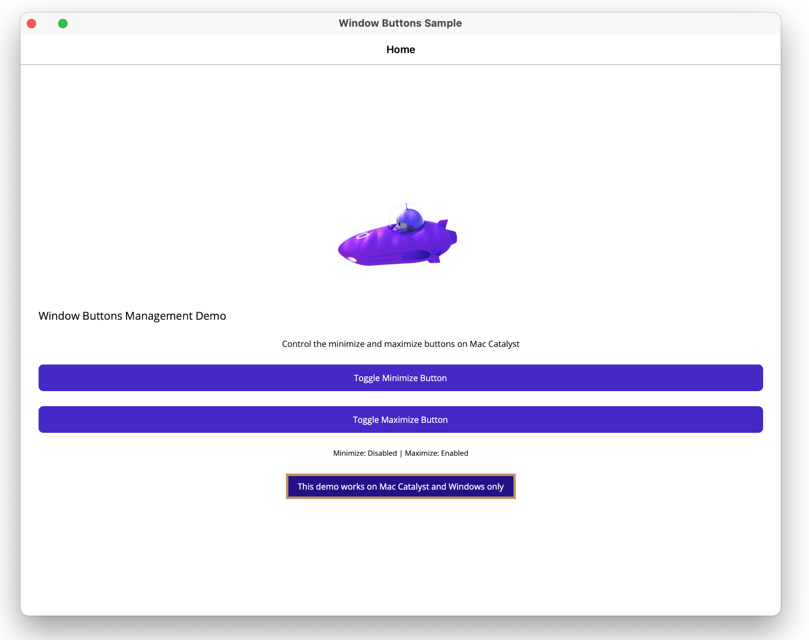

# Custom Window Buttons Handler in .NET MAUI

This sample demonstrates how to create a custom handler to modify window buttons (maximize, minimize, close) in .NET MAUI applications across different platforms.

## Overview

This sample shows how to:
- Create platform-specific handlers for window button customization
- Implement custom window controls for Windows and macOS
- Handle window state changes and button interactions

## Key Features

- Custom window button styling and behavior
- Platform-appropriate implementations
- Window state management