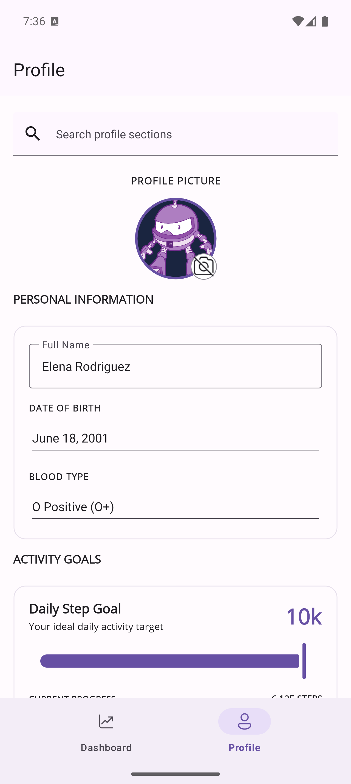
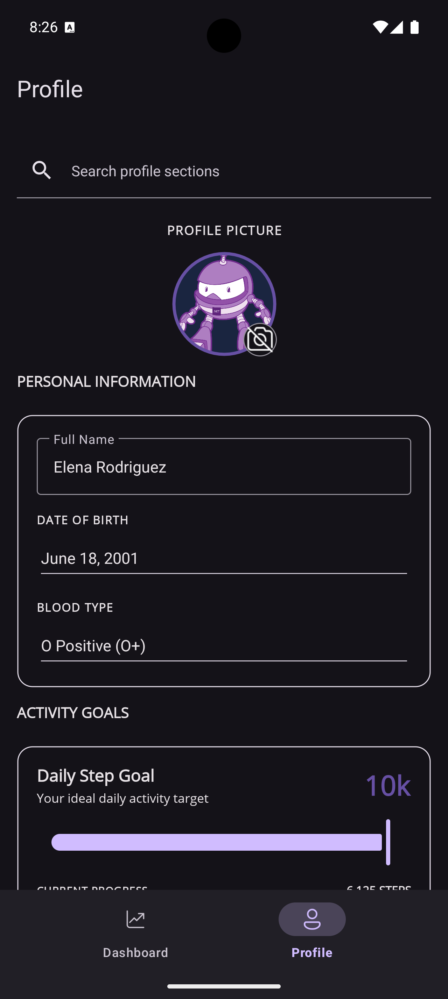

# Material3

| Material3 Light Theme Output | Material3 Dark Theme Output |
| --- | --- |
|  |  |

.NET Multi-platform App UI (.NET MAUI) apps can enable Material 3 styling on Android by setting the `UseMaterial3` build property to `true` in the project file.

This sample demonstrates a .NET MAUI app that enables Material 3 and shows how common controls render in light and dark themes, including SearchBar, Entry, DatePicker, Picker, Slider, ProgressBar, RadioButton, CheckBox, Switch, Button, and ImageButton.

For more details about Material 3, see:

- [Material Design 3 Components](https://m3.material.io/components)
- [Google Material Android API Reference (com.google.android.material)](https://developer.android.com/reference/com/google/android/material/classes)

For more information about this sample, see [.NET MAUI Material 3](https://learn.microsoft.com/en-us/dotnet/maui/user-interface/material-design?view=net-maui-10.0).
