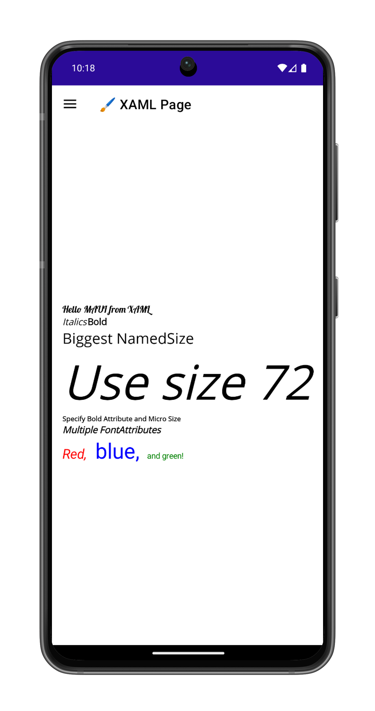

# Working with Fonts in .NET MAUI

.NET MAUI lets you specify font attributes (including weight and size) on controls that display text. Font information can be specified in code or specified in XAML. It's also possible to use a custom font, and display font icons

