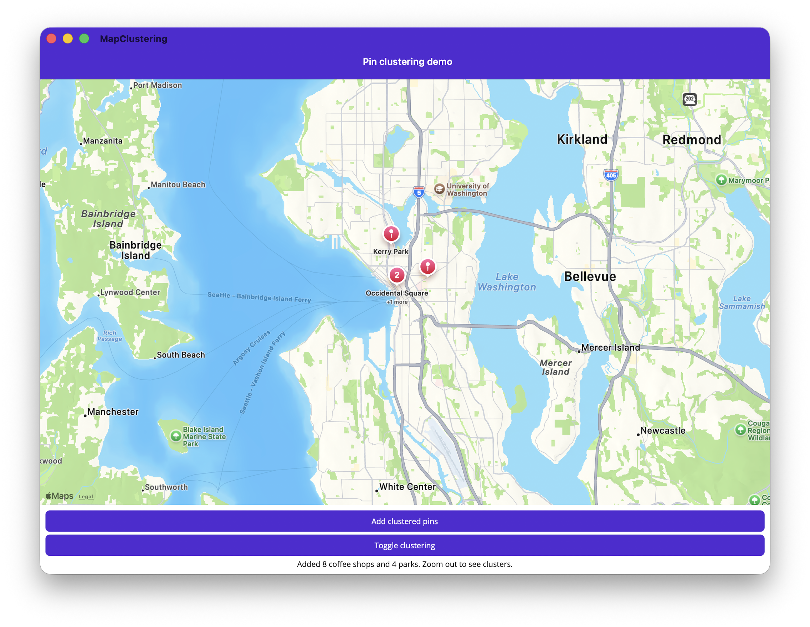

# Map Pin Clustering

This sample demonstrates the pin clustering feature introduced in .NET MAUI 11 for the Map control.

## Features

- **Enable clustering** — Set `Map.IsClusteringEnabled` to group nearby pins into cluster markers.
- **Clustering identifiers** — Use `Pin.ClusteringIdentifier` to create separate clustering groups (e.g., coffee shops cluster independently from parks).
- **Cluster tap handling** — Handle the `Map.ClusterClicked` event to display cluster details or suppress the default zoom behavior.
- **Toggle clustering** — Dynamically enable/disable clustering at runtime.

## Prerequisites

- .NET 11 Preview 3 or later
- .NET MAUI workload installed
- Android: Google Maps API key configured in `AndroidManifest.xml`
- iOS/Mac Catalyst: No additional configuration required

## Build and run

1. Open `MapClustering.sln` in Visual Studio 2022 or later.
2. For Android, add your Google Maps API key to `Platforms/Android/AndroidManifest.xml`.
3. Select a target platform and run.

## Key APIs

- [`Map.IsClusteringEnabled`](https://learn.microsoft.com/dotnet/maui/user-interface/controls/map#pin-clustering)
- [`Pin.ClusteringIdentifier`](https://learn.microsoft.com/dotnet/maui/user-interface/controls/map#clustering-identifiers)
- [`Map.ClusterClicked`](https://learn.microsoft.com/dotnet/maui/user-interface/controls/map#handle-cluster-taps)
- `ClusterClickedEventArgs` — `Pins`, `Location`, `Handled`

## Platform support

| Platform | Clustering supported |
|----------|---------------------|
| Android | ✅ Custom grid-based algorithm |
| iOS | ✅ Native MKClusterAnnotation |
| Mac Catalyst | ✅ Native MKClusterAnnotation |
| Windows | ❌ Not yet supported |
