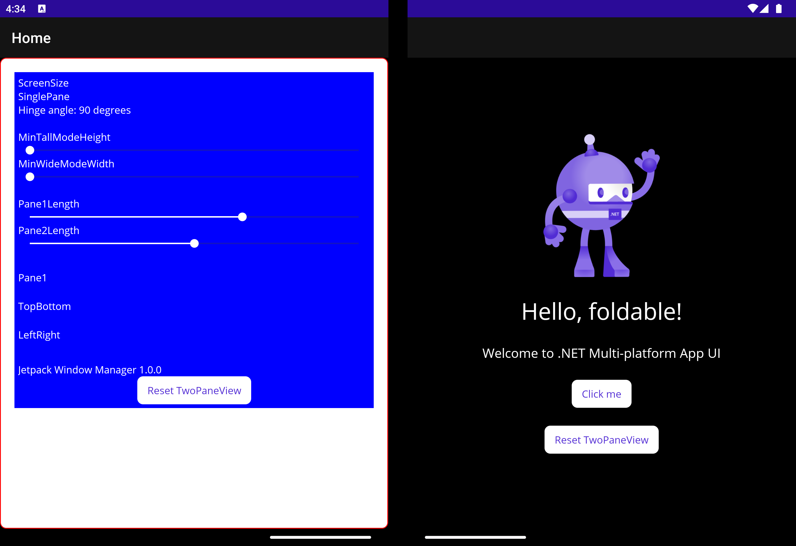

## .NET MAUI TwoPaneView demo (.NET 7 RC)

> **NOTE**
> .NET 7 and MAUI foldable support are both currently in preview / release candidate

This sample demonstrates the different properties of the TwoPaneView layout control and how the affect its child views.

Most details from the old [Xamarin TwoPaneView control](https://learn.microsoft.com/xamarin/xamarin-forms/app-fundamentals/dual-screen/twopaneview) still apply.

## Resources

- [.NET MAUI docs](https://docs.microsoft.com/dotnet/maui)
- [Surface Duo developer docs](https://docs.microsoft.com/dual-screen)
