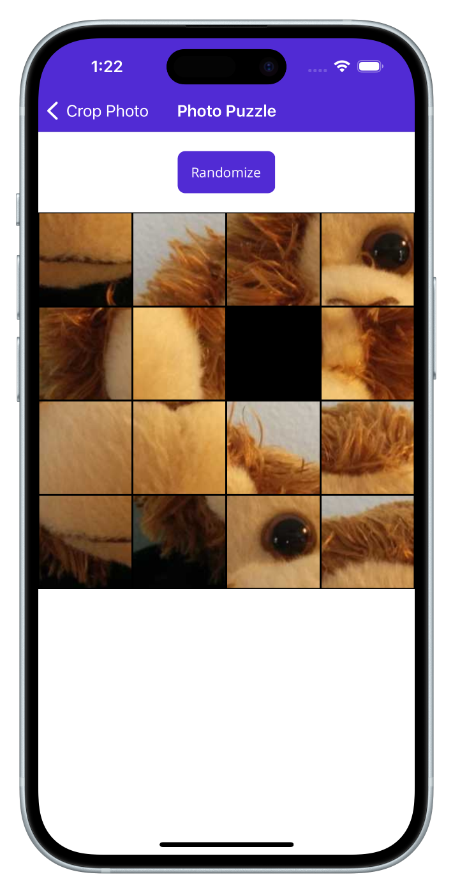

# Photo Puzzle

This sample demonstrates the use of SkiaSharp in a .NET Multi-platform App UI (.NET MAUI) app. It's a variation of the classic 15 puzzle. On the early Mac, the 15 puzzle was called PUZZLE. In early Windows, it was the only sample for Microsoft Pascal for Windows 1.0, where it was called MUZZLE (for "Microsoft Puzzle"). This is the .NET MAUI version.

   

After pressing the **Randomize** button, just tap a tile to move it into an empty position. You can *tap* any tile in the row or column of the empty position to move one, two, or three tiles at once. Use the numbers in the lower-right corner of each tile as a guide.

## Use SkiaSharp in an app

To use SkiaSharp in your .NET MAUI app you should:

1. Add the `SkiaSharp.Views.Maui.Controls` NuGet package to your app. This will also install dependent SkiaSharp packages.
1. Initialize SkiaSharp in your app by calling the `UseSkiaSharp` method on the `MauiAppBuilder` object in your `MauiProgram` class:


```csharp
using Microsoft.Extensions.Logging;
using SkiaSharp.Views.Maui.Controls.Hosting;

namespace MyMauiApp;

public static class MauiProgram
{
    public static MauiApp CreateMauiApp()
    {
        var builder = MauiApp.CreateBuilder();
        builder
            .UseMauiApp<App>()
            .UseSkiaSharp()
            .ConfigureFonts(fonts =>
            {
                fonts.AddFont("OpenSans-Regular.ttf", "OpenSansRegular");
                fonts.AddFont("OpenSans-Semibold.ttf", "OpenSansSemibold");
            });

        #if DEBUG
        builder.Logging.AddDebug();
        #endif

        return builder.Build();
    }
}
```
