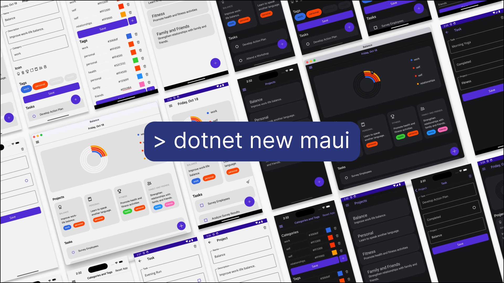

# Developer Balance

*Developer Balance* is a sample app and the inspiration for a new optional project template in .NET 9. The app first appeared at [.NET Conf 2024](https://youtu.be/ikSNL-lxolc?si=6STz-dR9WFMvCigu&t=2089).

This "to do" app demonstrates usage of fundamental community libraries and development patterns that we recommend.

* .NET MAUI: http://learn.microsoft.com/dotnet/maui
* CommunityToolkit.Mvvm: https://learn.microsoft.com/windows/communitytoolkit/mvvm/introduction
* CommunityToolkit.Maui: https://github.com/CommunityToolkit/Maui
* Microsoft.Data.Sqlite: https://learn.microsoft.com/en-us/dotnet/standard/data/sqlite
* Syncfusion Toolkit for .NET MAUI: https://help.syncfusion.com/maui-toolkit

