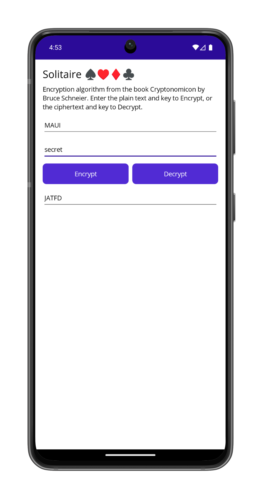

# Solitaire Encryption

A C# port of the [Solitaire encryption algorithm](https://www.schneier.com/solitaire.html) featured in Neal Stephenson's novel [Cryptonomicon](http://en.wikipedia.org/wiki/Cryptonomicon). The algorithm has been implemented in a .NET MAUI app for iOS, Android, Windows, and macOS (along with a test project using xUnit containing the [tests from the author's website](https://www.schneier.com/code/sol-test.txt)). The algorithm itself is based on a deck of cards, however you don't see this when using the app; for more info check the source code or the [details of how it works](https://www.schneier.com/solitaire.html).

