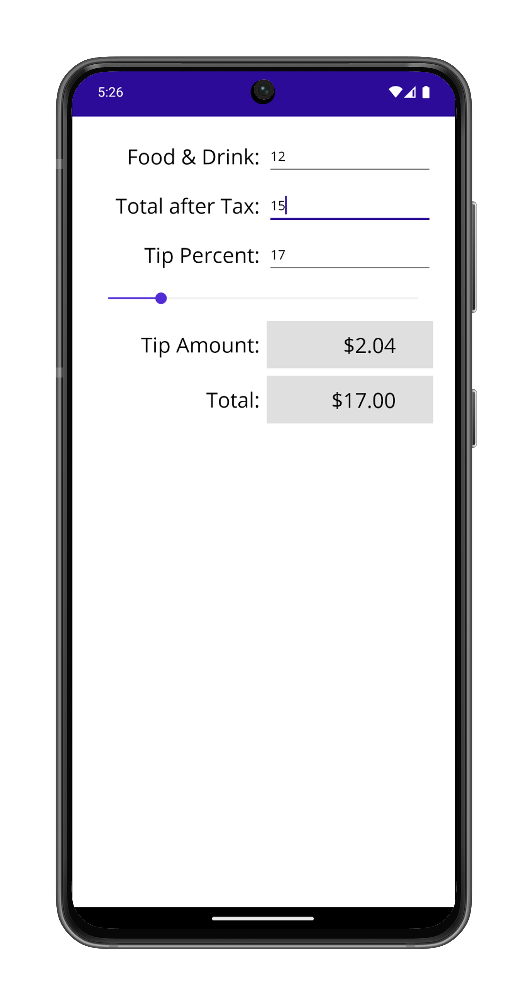

# TipCalc

TipCalc is based on an existing iOS and Android sample but has been completely rewritten for .NET MAUI
using XAML and data-binding. This new version now builds for iOS, Android, Windows, and Mac Catalyst.

TipCalc lets you type in a food-and-drink subtotal
and a post-tax total from your restaurant bill and then select a tip percentage. It applies the percentage
to the food-and-drink subtotal and adds the result to the post-tax total, rounded to the nearest quarter.

The calculations are handled in a *TipCalcModel* class, and the entire user interface is realized in
XAML in the TipCalcPage.xaml file. Two data-binding value converters help massage the data between the data model and the XAML file.

