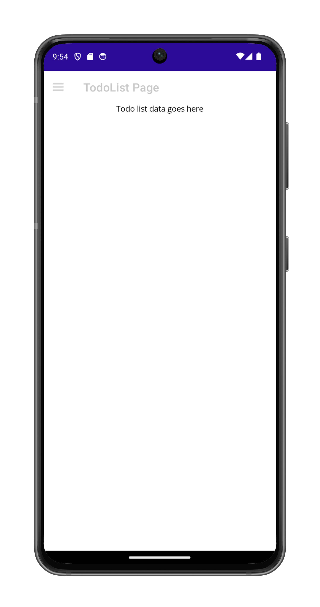

# FlyoutPageNavigation

This sample demonstrates how to use a `FlyoutPage` and navigate between its pages of information in .NET MAUI.

A `FlyoutPage` manages two related pages of information: a flyout page that presents items, and a detail page that displays the details about items on the flyout page. The flyout page typically contains a header and a list, where each list item can navigate to a different detail page.

For more information about the sample see [FlyoutPage](https://docs.microsoft.com/dotnet/maui/user-interface/controls/flyoutpage).

