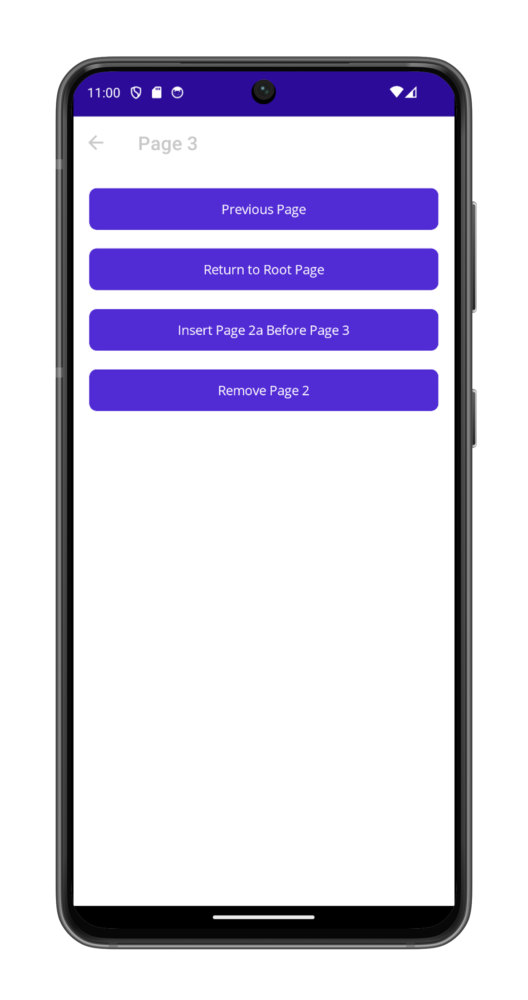

# WorkingWithNavigation

This sample demonstrates how to perform hierarchical navigation through a stack of pages in .NET MAUI. The app shows various navigation patterns including pushing pages to the navigation stack, popping pages, returning to the root page, inserting pages before other pages, and removing pages from the navigation stack.

The sample includes both programmatic C# pages and XAML-based pages to demonstrate different approaches to creating user interfaces and navigation in .NET MAUI.

