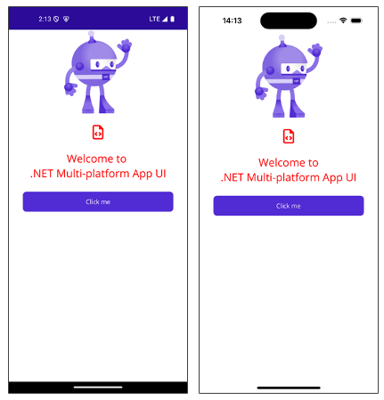

# .NET MAUI NuGet Package with MSBuild files sample

A basic example of how to use MSBuild files in NuGet packages. This sample is geared toward use by .NET MAUI developers specifically but the overall concepts are applicable to .NET in general.

See [DevOps read me](/README_DevOps.md) for details on the building and publishing with GitHub Actions.

## The Problem

There are situations where, as a .NET MAUI NuGet package author, you may want to automate project configuration or perform custom build logic to simplify the setup process for users and reduce opportunity for errors and inconsistencies. For example, configuring some project settings, including package files with the requisite build actions, or performing other necessary operations through [MSBuild tasks](https://learn.microsoft.com/visualstudio/msbuild/msbuild-tasks?view=vs-2022#task-logic).

## The Approach

The [MSBuild system](https://learn.microsoft.com/visualstudio/msbuild/msbuild-concepts?view=vs-2022) is highly customizable and extensible. It enables us to [split build configuration](https://learn.microsoft.com/aspnet/web-forms/overview/deployment/web-deployment-in-the-enterprise/understanding-the-project-file#splitting-project-files-to-support-multiple-environments) across multiple standalone [project files](https://learn.microsoft.com/aspnet/web-forms/overview/deployment/web-deployment-in-the-enterprise/understanding-the-project-file#msbuild-and-the-project-file), typically with [.props and .targets](https://learn.microsoft.com/en-us/nuget/concepts/msbuild-props-and-targets) extensions, for [use in multiple projects](https://learn.microsoft.com/visualstudio/msbuild/how-to-use-the-same-target-in-multiple-project-files?view=vs-2022).

In MSBuild,  [.props and .targets](https://learn.microsoft.com/en-us/nuget/concepts/msbuild-props-and-targets) files serve different purposes and are used at different stages of the build process. Typically, ```.props``` files are used to define properties for use throughout the build process and are imported early on. The ```.targets``` files, on the other hand, can contain item definitions, properties, targets, and tasks which get imported later in the build process.

NuGet packages can optionally include MSBuild [.props and .targets](https://learn.microsoft.com/en-us/nuget/concepts/msbuild-props-and-targets) files within its [build folders](https://learn.microsoft.com/nuget/concepts/msbuild-props-and-targets#build-folders). When projects [consume packages containing build files](https://learn.microsoft.com/nuget/concepts/msbuild-props-and-targets#projects-consuming-packages-with-build-files) in the form of ```<package_id>.<extension>```, those files effectively get imported automatically. Files in the root build folders are considered suitable for all frameworks whereas [framework specific build folders](https://learn.microsoft.com/nuget/concepts/msbuild-props-and-targets#framework-specific-build-folder) are used where applicable.

Packages like [Microsoft.Maui.Controls.Build.Tasks](https://nuget.info/packages/Microsoft.Maui.Controls.Build.Tasks/9.0.22) use this technique to apply TFM (target framework moniker) specific settings. For example, the ```Microsoft.Maui.Controls.Build.Tasks.targets``` file (within the buildTransitive > net6.0-ios10.0 folder) defines a ```PropertyGroup``` that conditionally sets ```MtouchLink``` to ```None```.

```xml
<Project>
  <PropertyGroup>
    <MtouchLink Condition="'$(MtouchLink)' == '' and '$(Configuration)' == 'Debug' and '$(UseInterpreter)' == 'true'">None</MtouchLink>
  </PropertyGroup>
</Project>
```

## The Sample

This first-principles example shows how to add a ```.targets``` file to a package, created from a .NET MAUI class library project, alongside the resulting assembly and other sample content via [csproj configuration](src/SamplePackage/SamplePackage.csproj#L44). In this case, the example [SamplePackage.targets](/pkg_content/SamplePackage.targets) file just includes some assets from the package with the [MauiFont](https://learn.microsoft.com/dotnet/maui/user-interface/fonts?view=net-maui-9.0#register-fonts) and [MauiImage](https://learn.microsoft.com/dotnet/maui/user-interface/images/images?view=net-maui-9.0) build actions as a means to demonstrate the concept.

```xml
<Project xmlns="http://schemas.microsoft.com/developer/msbuild/2003">
    <ItemGroup>
        <MauiFont Include="$(MSBuildThisFileDirectory)..\fonts\Font Awesome 6 Free-Regular-400.otf" Visible="False">
            <Link>%(Filename)%(Extension)</Link>
        </MauiFont>
        <MauiImage Include="$(MSBuildThisFileDirectory)..\images\sample_bot.svg" Visible="False">
            <Link>%(Filename)%(Extension)</Link>
        </MauiImage>
    </ItemGroup>
</Project>
```

The package is then consumed by a .NET MAUI application within the same solution  to demonstrate the ```.targets``` configuration has been imported successfully.

The [MauiImage](https://learn.microsoft.com/dotnet/maui/user-interface/images/images?view=net-maui-9.0) items can be used in [MainPage.xaml](src/PackageConsumerApp/MainPage.xaml) with no additional setup.

```xaml
<Image
    Source="sample_bot.png"
    HeightRequest="185"
    Aspect="AspectFit" />
```

The [MauiFont](https://learn.microsoft.com/dotnet/maui/user-interface/fonts?view=net-maui-9.0#register-fonts) must get registered in [MauiProgram.cs](src/PackageConsumerApp/MauiProgram.cs) as an additional step.

```cs
builder.ConfigureFonts(fonts =>
{
    fonts.AddFont("Font Awesome 6 Free-Regular-400.otf", "FontAwesome");
});
```

Once registered, the font alias and glyphs can be used by [MainPage.xaml](src/PackageConsumerApp/MainPage.xaml).

```xaml
<Label
    Text="&#xf1c9;"
    FontFamily="FontAwesome" />
```

To embellish the sample a little, the [SamplePackage](src/SamplePackage/) project includes some additional components:

- [AppBuilderExtensions.cs](src/SamplePackage/AppBuilderExtensions.cs): Extension method for use with ```MauiAppBuilder``` encapsulating the font registration
- [BrandColors.xaml](src/SamplePackage/BrandColors.xaml): ResourceDictionary defining some color resources for use by the test app
- [FontAwesomeGlyphs.cs](src/SamplePackage/FontAwesomeGlyphs.cs): Constant strings for the ```FontAlias``` and ```Code``` glyph
- [PackageImages.cs](src/SamplePackage/PackageImages.cs): Constant strings for resolving the images

The ```UseSamplePackage()``` method from [AppBuilderExtensions.cs](src/SamplePackage/AppBuilderExtensions.cs) gets called from [MauiProgram.cs](src/PackageConsumerApp/MauiProgram.cs).

```cs
public static class MauiProgram
{
    public static MauiApp CreateMauiApp()
    {
        var builder = MauiApp.CreateBuilder();
         builder
            .UseMauiApp<App>()
            .UseSamplePackage()
            .ConfigureFonts(fonts =>
            {
                fonts.AddFont("OpenSans-Regular.ttf", "OpenSansRegular");
                fonts.AddFont("OpenSans-Semibold.ttf", "OpenSansSemibold");
            });

        return builder.Build();
    }
}
```

The [FontAwesomeGlyphs](src/SamplePackage/FontAwesomeGlyphs.cs) and [PackageImages](src/SamplePackage/PackageImages.cs) classes can be optionally used in [MainPage.xaml](src/PackageConsumerApp/MainPage.xaml) instead of raw string values.

```xml
<Image
    Source="{x:Static sp:PackageImages.DotnetBot}"
    HeightRequest="185"
    Aspect="AspectFit" />

<Label
    Text="{x:Static sp:FontAwesomeGlyphs.Code}"
    FontFamily="{x:Static sp:FontAwesomeGlyphs.FontAlias}"
    TextColor="{StaticResource PrimaryBrandColor}" />

<Label
    Text="Welcome to &#10;.NET Multi-platform App UI"
    TextColor="{StaticResource PrimaryBrandColor}" /> 
```



## Running the sample

### Initial setup

If you have freshly cloned the repository, you must perform the following steps before loading the [SamplePackage solution](src/SamplePackage.sln):

1. In Terminal, change the directory to the root of this sample (the folder containing this file)
1. Use ```dotnet build``` to create the initial NuGet package for the [SamplePackage project](/SamplePackage/SamplePackage.csproj).

    ```cli
    dotnet build src/SamplePackage/SamplePackage.csproj
    ```

> [!IMPORTANT]
> Building the [SamplePackage project](/SamplePackage/) results in the NuGet package getting created automatically. The package gets output to a local git ignored ```artifacts``` folder under ```src```. The .NET MAUI test app resolves the package from this directory instead of using a project reference. See [notable details](#notable-details) for more information.

### Building and running

1. Open the [SamplePackage solution](src/SamplePackage.sln) in Visual Studio / Visual Studio Code
1. Set the [PackageConsumerApp](src/PackageConsumerApp/PackageConsumerApp.csproj) as the startup project
1. Build and run the app.

> [!IMPORTANT]
> After making changes to the [SamplePackage](src/SamplePackage/SamplePackage.csproj) project, to test it using the [PackageConsumerApp](src/PackageConsumerApp/) project:
>
> - Build [SamplePackage](src/SamplePackage/SamplePackage.csproj)
> - Rebuild and run the [PackageConsumerApp](src/PackageConsumerApp/) project

## Notable details

The [SamplePackage solution](src/) is comprised of two projects. The [SamplePackage class library](src/SamplePackage/) and a .NET MAUI test app, [PackageConsumerApp](src/PackageConsumerApp/). To demonstrate the relevant NuGet and MSBuild concepts, the test app references the generated NuGet package rather than the class library project itself.

The solution has been configured to simplify updating the test app to use new versions of the library project NuGet package. In this case, a new package gets generated automatically when building the class library project. Changes to the package are then observed after you rebuild the test app or when you start debugging it. The approach being used is described in more detail in the [NuGet DevLoop Sample](https://github.com/Redth/NuGetDevLoopSample?tab=readme-ov-file#the-approach) repo.

### SamplePackage project

The [SampleProject csproj file](src/SamplePackage/SamplePackage.csproj) defines some typical [package metadata](https://learn.microsoft.com/nuget/create-packages/package-authoring-best-practices#package-metadata) and some other properties relating to the pack operation. Notably, ```PackageVersion```, ```PackageOutputPath```, and ```GeneratePackageOnBuild```.

```xml
<PropertyGroup>
    ...
    <PackageVersion>0.0.99999-sample</PackageVersion>
    <PackageOutputPath>../artifacts/</PackageOutputPath>
    <GeneratePackageOnBuild>true</GeneratePackageOnBuild>
</PropertyGroup>
```

In addition to the standard packaging properties, an ```<ItemGroup>``` includes the files from the [Content](src/SamplePackage/Content/) folder so they are packed into the appropriate folders within the resulting package.

```xml
<ItemGroup>
    ...
    <None Include="Content\font_awesome\*" Pack="true" PackagePath="\fonts" />
    <None Include="Content\images\*" Pack="true" PackagePath="\images" />
    <None Include="Content\resources\*" Pack="true" PackagePath="\resources" />
    <None Include="Content\SamplePackage.targets" Pack="true" PackagePath="\build\SamplePackage.targets" />
    <None Include="Content\SamplePackage.targets" Pack="true" PackagePath="\buildTransitive\SamplePackage.targets" />
</ItemGroup>
```

The ```None``` build action is used so these files are not included in the build process. The ```Pack``` attribute determines that the items should be packed. Their paths within the package have been specififed using the ```PackagePath``` attribute.

Lastly, the ```Microsoft.SourceLink.GitHub``` and ```System.Management``` packages are referenced. The former links the source code to the corresponding files in the repo for easier debugging and the latter is specific to Windows builds providing access to system management information.

```xml
<ItemGroup>
    <PackageReference Include="Microsoft.SourceLink.GitHub" Version="1.0.0" PrivateAssets="all" IsImplicitlyDefined="true" />
    <PackageReference Include="System.Management" Version="7.0.0" Condition="$(TargetFramework.Contains('-windows')) == true" />
</ItemGroup>
```

### PackageConsumerApp project

The [PackageConsumerApp](src/PackageConsumerApp/PackageConsumerApp.csproj) test app references the ```SamplePackage``` NuGet package built in the same solution.

```xml
<ItemGroup>
    <PackageReference Include="SamplePackage" Version="0.0.99999-sample" />
</ItemGroup>
```

## Attributions

This sample uses the ```Font Awesome 6 Free-Regular-400``` otf provided under MIT license by [Font Awesome](https://fontawesome.com/download).

Original sample: [msbuild-nuget-sample](https://github.com/mikeparker104/msbuild-nuget-sample/tree/main?tab=readme-ov-file).
