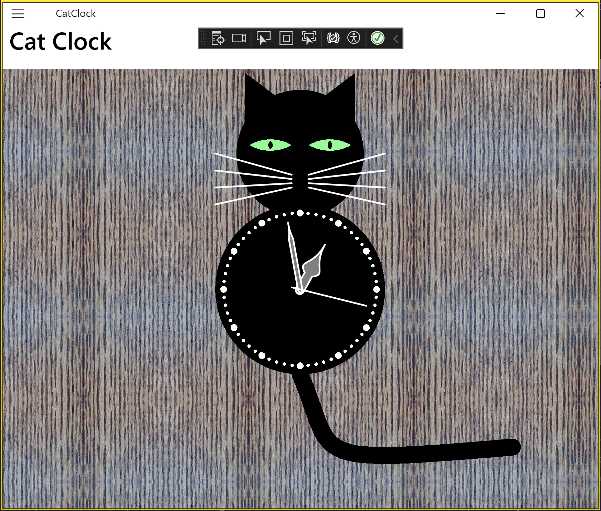

# Cat Clock

This sample demonstrates various features of SkiaSharp graphics in a .NET Multi-platform App UI (.NET MAUI app).



## Use SkiaSharp in an app

To use SkiaSharp in your .NET MAUI app you should:

1. Add the `SkiaSharp.Views.Maui.Controls` NuGet package to your app. This will also install dependent SkiaSharp packages.
1. Initialize SkiaSharp in your app by calling the `UseSkiaSharp` method on the `MauiAppBuilder` object in your `MauiProgram` class:


```csharp
using Microsoft.Extensions.Logging;
using SkiaSharp.Views.Maui.Controls.Hosting;

namespace MyMauiApp;

public static class MauiProgram
{
    public static MauiApp CreateMauiApp()
    {
        var builder = MauiApp.CreateBuilder();
        builder
            .UseMauiApp<App>()
            .UseSkiaSharp()
            .ConfigureFonts(fonts =>
            {
                fonts.AddFont("OpenSans-Regular.ttf", "OpenSansRegular");
                fonts.AddFont("OpenSans-Semibold.ttf", "OpenSansSemibold");
            });

        #if DEBUG
        builder.Logging.AddDebug();
        #endif

        return builder.Build();
    }
}
```
