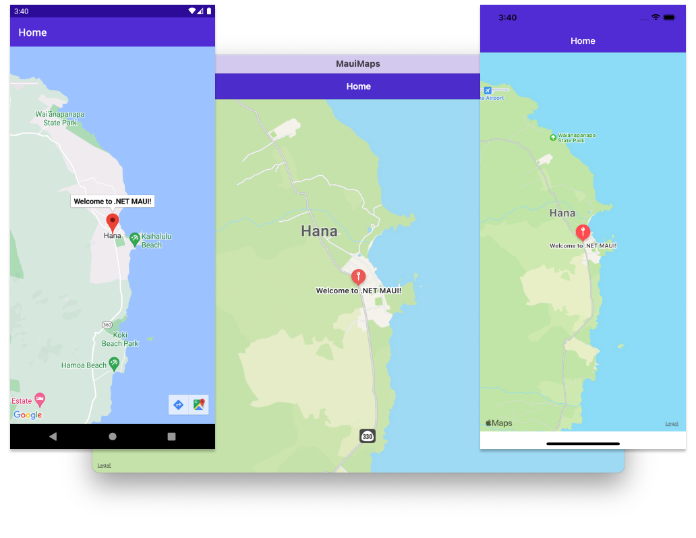

# Map

The `Map` control displays a map, and requires the [Microsoft.Maui.Controls.Maps](https://www.nuget.org/packages/Microsoft.Maui.Controls.Maps/) NuGet package.

To use this sample on Android you must obtain a Google Maps API key and insert it into the *AndroidManifest.xml* file. For more information about obtaining a Google Maps API key, see [Get a Google Maps API key](https://learn.microsoft.com/dotnet/maui/user-interface/controls/map#get-a-google-maps-api-key).

For more information about this sample, see [.NET MAUI Map](https://learn.microsoft.com/dotnet/maui/user-interface/controls/map).

