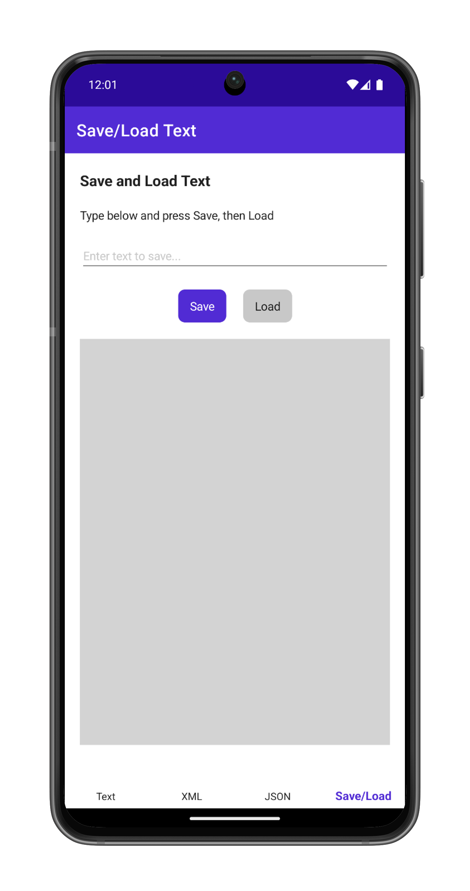

# Working with Files in .NET MAUI

These samples relate to working with files in .NET MAUI using `System.IO` and demonstrate how to load, save, and display text, XML, and JSON resources.

For more information, see the [.NET MAUI documentation on working with files](https://learn.microsoft.com/dotnet/maui/data-cloud/files/).

